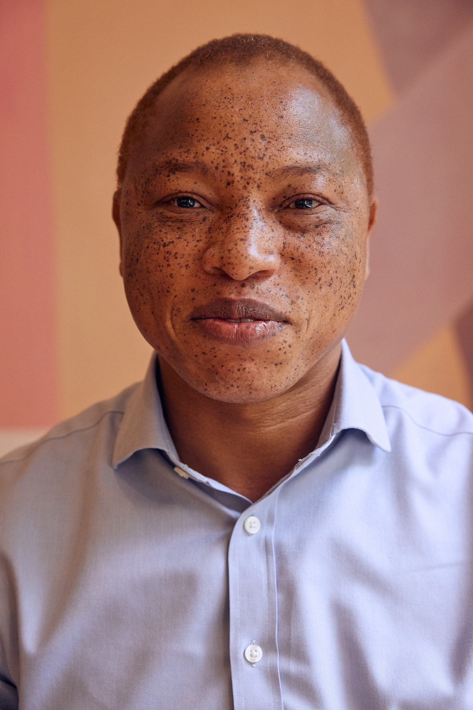
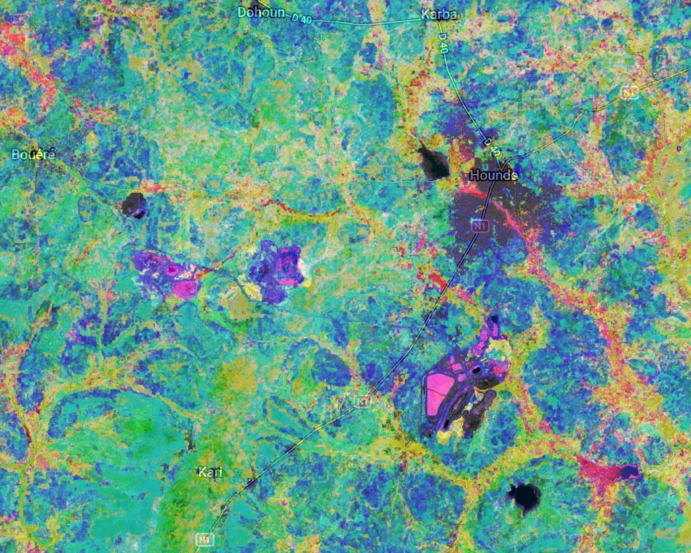

---
hide:
  - toc
  - navigation
---
<!--
CHECKLIST FOR THIS PAGE:
- [ ] Replace [YOUR NAME] with your full name (3 places)
- [ ] Replace [YOUR JOB TITLE] with your current or target role
- [ ] Replace [YOUR TAGLINE] with a short phrase describing your focus
- [ ] Rewrite the About Me paragraph with your own words
- [ ] Replace assets/images/profile.png with your actual photo (keep the filename or update it below)
- [ ] Replace assets/images/about.png with your own image (a field photo, map, or workspace shot)
- [ ] Edit the skill cards to match your actual skills (add, remove, or rename cards as needed)
- [ ] Update GitHub and LinkedIn links in the Connect section
- [ ] Add your CV PDF to docs/assets/ and update the filename in the Download CV button
-->

  
  <h1>Ali Barro</h1>
  
<strong>Founder @ GGG</strong>

  
<em>Turning spatial data into insights | Geology | GIS | Remote Sensing | Data Analytics</em>

---

## **About Me**

My background is in Geology and Geophysics. I specialised in geospatial data analysis and visualisation. I spent 15 years managing, processing and interpretating mineral exploration data. Now, I am working on automating workflow of predictive mineral resource targeting based on remote sensing imagery and GIS to drastically reduce the cost of prospection. I am mainly using Colab, Google Earth Engine and QGIS (of course!). 
Besides that, I am developing GGG (Golden Geo GIS) to associate my passion for remote database administration. 

  

---

[View My Projects :material-arrow-right:](projects/index.md){ .md-button .md-button--primary }
[Download CV :material-download:](assets/CV_ALI_BARRO.pdf){ .md-button }

---

## Skills

-   :material-layers:{ .lg .middle } **GIS & Remote Sensing**

    ---

    - Geosoft Oasis Montaj, QGIS, Datamine, Google Earth Engine
    - GRASS GIS
    - Multispectral image analysis
    

-   :material-code-braces:{ .lg .middle } **Programming**

    ---

    - Python — GeoPandas, NumPy, Pandas, Matplotlib
    - ggplot2
    - JavaScript — Leaflet, MapLibre GL
    - SQL, PostgreSQL + PostGIS

-   :material-star-four-points:{ .lg .middle } **Machine Learning & GeoAI**

    ---

    - Supervised classification — Random Forest
    - scikit-learn, PyTorch, TensorFlow
    - Object detection in satellite imagery

-   :material-earth:{ .lg .middle } **Web Mapping & Data**

    ---

    - Geoserver
    - Google Cloud Storage
    - Data formats — GeoTIFF
    

-   :material-database:{ .lg .middle } **Data & Cloud**

    ---

    - PostgreSQL + PostGIS
    - Cloud storage: Google Cloud Storage
    - Data formats: GeoJSON, GeoTIFF

---

## Connect

[GitHub](https://github.com/alibarro){ .md-button }
[LinkedIn](https://linkedin.com/in/alibarro){ .md-button }
