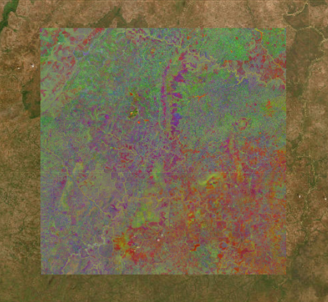
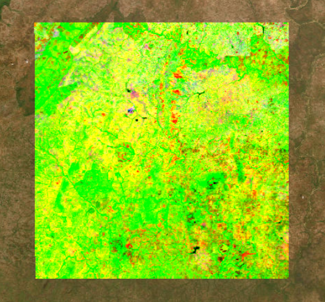

---
hide:
  - toc
  - navigation
---
<!--
CHECKLIST FOR THIS PAGE:
- [ ] Replace the two placeholder cards (marked [YOUR PROJECT ...]) with your real projects
- [ ] For each project: add a thumbnail image to docs/assets/images/ and update the path below
- [ ] For each project: create a project page by copying sample-project.md
- [ ] For each project: add a nav entry in mkdocs.yml (see the comments there)
- [ ] Delete placeholder cards you don't need yet
-->

# Projects

A selection of my geospatial projects. Click any card to see the full write-up.

**[Mapping of Mineral Alteration and Principal Component Analysis](Sentinel-alteration-PCA.md)**

This project used Principal Component Analysis (PCA) and band ratio techniques on Sentinel-2A imagery to identify invisible hydrothermal alteration zones and iron oxide signatures in Dissin, Burkina Faso, supporting mineral exploration by revealing surface alteration patterns not visible in standard true-color imagery

`GEE` `Python` `Colab`

[View Project →](Sentinel-alteration-PCA.md){ .md-button }

**[Mineral alteration and Principal Component Analysis](Sentinel-2A-Dissin.ipynb)**

Results to be published soon

`GEE` `JavaScript` `Colab` `Python` `VS Studio`

[View Project →](Sentinel-2A-Dissin.ipynb){ .md-button }

